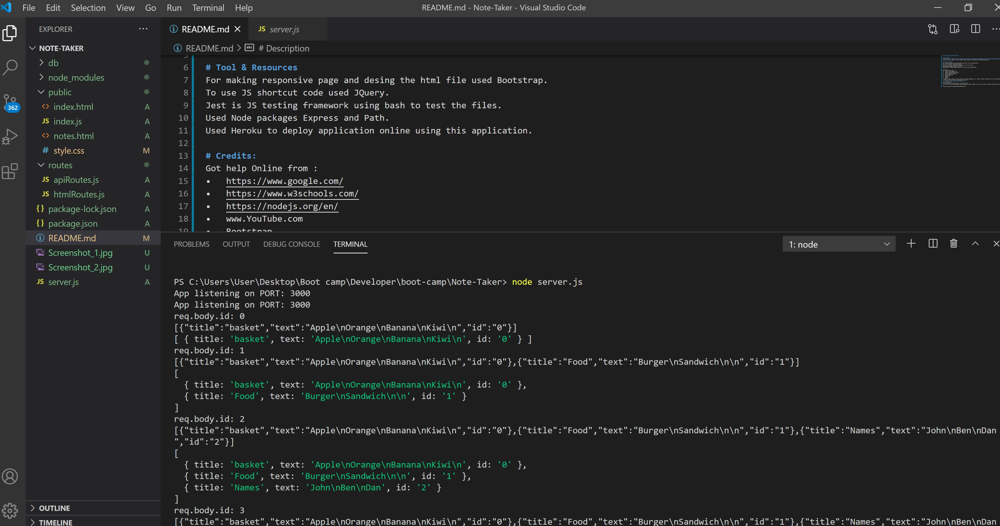
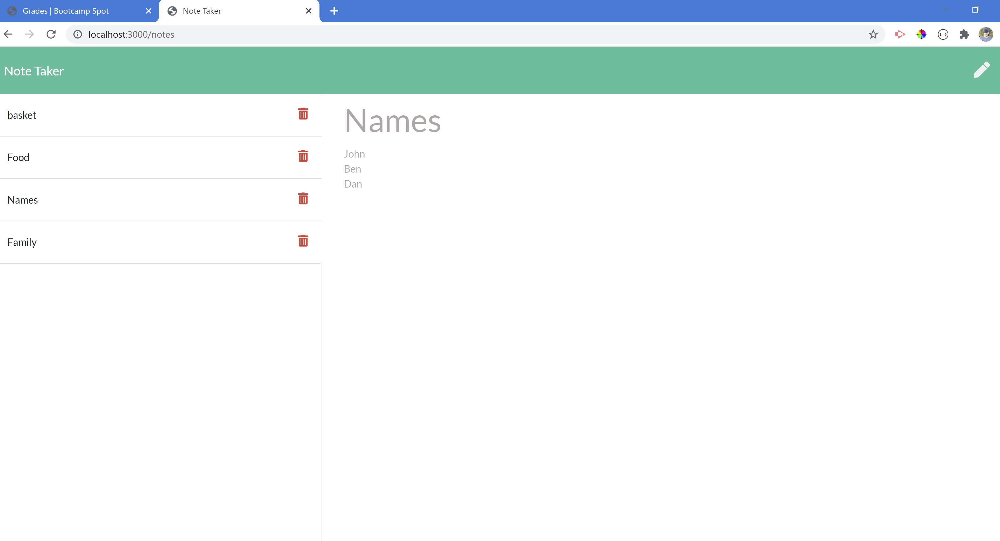
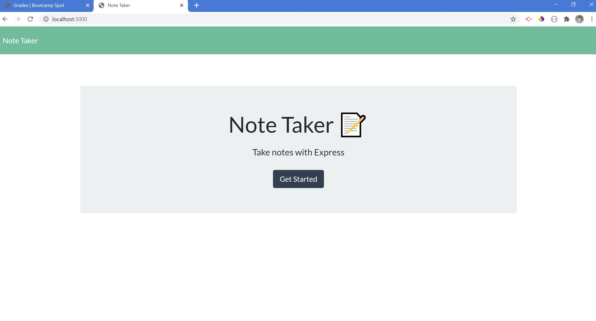

# Note-Taker By Merdad Karkudi

# Description
Create an app to take, save and retrieve user data on the page. This application will use an Express and Path backend and save and retrieve note data from a JSON file via routes. These routes and functions are tested using Jest.

# project repository link : 
https://github.com/mkarkuody/Note-Taker

# Screenshots

# demo video link :

# Tool & Resources
For making responsive page and desing the html file used Bootstrap.
To use JS shortcut code used JQuery.
Jest is JS testing framework using bash to test the files.
Used Node packages Express and Path.
Used Heroku to deploy application online using this application.

# Credits:
Got help Online from : 
•	https://www.google.com/
•	https://www.w3schools.com/  
•   https://nodejs.org/en/
•	www.YouTube.com 
•   Bootstrap 
•   JQuery 
•   Heroku 
 Thanks to John Young my class instructor and Ben Vaagen my TA. special Thanks to Abdul Aziz my TA and Amanda Crawford My Tutor for helping me to understand the class and homework contents.
# To create a Note Taker using this app;
Clone repository.
In the directory with server.js run npm install
as soon as you see the Message,(App listening on PORT: 3000) you can work on your localhost and type on the save and retrieve the data.

https://github.com/kingsleyramos/Note-Taker